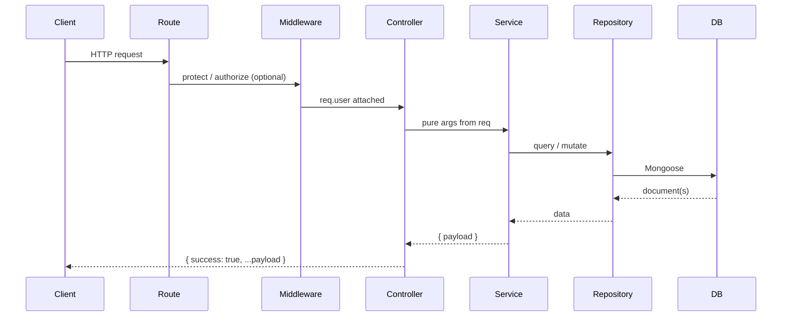

# NileCart API

REST API backend for **NileCart** — a multi-vendor fashion e-commerce platform (originally branded Saavana). It powers customer storefronts, seller dashboards, and admin operations: catalog browsing, cart/checkout, orders, coupons, reviews, seller onboarding, and Flutterwave online payments.

Built with **Node.js**, **Express**, and **MongoDB** (Mongoose). Uses **ES Modules** (`"type": "module"`).

---

## Table of contents

- [Tech stack](#tech-stack)
- [Project structure](#project-structure)
- [Architecture](#architecture)
- [Request lifecycle](#request-lifecycle)
- [Getting started](#getting-started)
- [Environment variables](#environment-variables)
- [Scripts](#scripts)
- [Authentication & roles](#authentication--roles)
- [API overview](#api-overview)
- [External integrations](#external-integrations)
- [Adding a new feature](#adding-a-new-feature)

---

## Tech stack

| Layer | Technology |
|-------|------------|
| Runtime | Node.js 18+ |
| HTTP | Express 4 |
| Database | MongoDB + Mongoose 9 |
| Auth | Firebase (customer/seller login) + JWT (httpOnly cookie + Bearer header) |
| Payments | Flutterwave v3 (hosted checkout, verify, webhooks) |
| File uploads | AWS S3 presigned URLs |
| Email (OTP) | Resend |
| Config | dotenv |

---

## Project structure

```
nileCart-server/
├── index.js                 # Entry point → imports src/server.js
├── package.json
├── .env.example             # Environment variable template
├── scripts/
│   ├── seed.js              # Demo categories, products, banners, coupons
│   ├── seedAdmin.js         # One-time platform admin bootstrap
│   └── verifyS3Access.js    # S3 IAM / bucket connectivity check
└── src/
    ├── server.js            # Connect DB, start HTTP server, graceful shutdown
    ├── app.js               # Express app factory (middleware, routes, errors)
    │
    ├── config/              # App configuration
    │   ├── env.js           # Typed env config (port, JWT, AWS, Flutterwave, …)
    │   ├── database.js      # MongoDB connection
    │   └── index.js
    │
    ├── routes/              # HTTP route definitions (mount paths + middleware)
    │   ├── index.js         # /api router — mounts all domain routes
    │   ├── user.routes.js
    │   ├── product.routes.js
    │   ├── order.routes.js
    │   └── …
    │
    ├── controllers/         # Thin HTTP layer — extract req, call services
    │   └── *.controller.js
    │
    ├── services/            # Business logic — pure functions, no req/res
    │   └── *.service.js
    │
    ├── repositories/        # Database access — wraps Mongoose models
    │   └── *.repository.js
    │
    ├── models/              # Mongoose schemas & documents
    │   ├── schemas/
    │   └── *.js
    │
    ├── middlewares/         # Auth, webhooks, global error handling
    │   ├── auth.middleware.js
    │   ├── error.middleware.js
    │   └── flutterwaveWebhook.middleware.js
    │
    ├── validators/          # Reusable validation helpers (no express-validator yet)
    │   ├── common.validator.js
    │   ├── auth.validator.js
    │   ├── pagination.validator.js
    │   └── index.js
    │
    ├── dto/                 # Response / data-transfer shapes (extensible)
    ├── constants/           # Enums (departments, order statuses, …)
    ├── cron/                  # Scheduled jobs (stub — none configured)
    ├── interfaces/            # Shared type/interface stubs
    │
    ├── utils/               # Cross-cutting utilities
    │   ├── AppError.js      # createError(message, statusCode)
    │   ├── response.js      # sendSuccess / sendError JSON helpers
    │   ├── asyncHandler.js
    │   └── helpers/         # Domain-specific pure logic (no HTTP)
    │       ├── controllerHelpers.js   # serviceHandler wrapper
    │       ├── orderBuilder.js        # Cart → order pipeline
    │       ├── couponHelpers.js
    │       ├── paymentHelpers.js
    │       └── …
    │
    └── vendor/              # Third-party SDK wrappers
        ├── firebase.vendor.js
        ├── flutterwave.vendor.js
        ├── s3.vendor.js
        └── resend.vendor.js
```

---

## Architecture

The codebase follows a **layered architecture**. Each layer has a single responsibility; dependencies flow **downward** only.

```
HTTP Request
     │
     ▼
  Routes          — URL mapping, middleware chains
     │
     ▼
  Controllers     — Parse req (params, body, user), invoke services
     │
     ▼
  Services        — Business rules, orchestration, throw errors with statusCode
     │
     ▼
  Repositories    — All Mongoose queries (find, create, update, aggregate)
     │
     ▼
  Models          — Schema definitions
     │
     ▼
  MongoDB
```

### Layer rules

| Layer | Does | Does not |
|-------|------|----------|
| **Routes** | Mount paths, apply `protect` / `authorize` | Business logic |
| **Controllers** | Extract HTTP input, return via `serviceHandler` | Direct DB access |
| **Services** | Validate, compute, call repositories & helpers | Touch `req` / `res` |
| **Repositories** | CRUD and query helpers per model | Business rules |
| **Helpers** | Pure logic (pricing, coupons, order building) | HTTP or direct model imports* |
| **Validators** | Shared field/format checks | Route-specific middleware chains (future) |

\* Complex helpers like `orderBuilder.js` use repositories for reads/writes; `.save()` on already-loaded documents is allowed for in-place mutations (stock decrement, etc.).

### Controllers: `serviceHandler`

Most controllers delegate to services through a small wrapper:

```javascript
// controllers/cart.controller.js
export const getCart = serviceHandler((req) => CartService.getCart(req.user._id));
```

`serviceHandler`:
1. Calls the service with `req`
2. Sends `{ success: true, ...payload }` via `sendSuccess`
3. Catches errors with `statusCode` and responds with `sendError`
4. Supports `result.__status` for non-200 responses (e.g. `201` on create)

Auth endpoints use a similar `authHandler` in `user.controller.js` that also sets/clears the JWT httpOnly cookie.

### Services: pure functions

Services accept plain arguments and return plain objects. They throw errors created with `createError(message, statusCode)` from `utils/AppError.js`.

```javascript
// services/cart.service.js
export const addToCart = async (userId, { productId, variantSku, quantity }) => {
  // … validation, repository calls …
  return { cart };
};
```

### Repositories

One file per Mongoose model (e.g. `product.repository.js`). Services and helpers import repositories — **not models directly** — for testability and consistent data access.

Barrel export: `src/repositories/index.js`.

---

## Request lifecycle



On failure, services throw `{ message, statusCode }`. Controllers and the global `errorHandler` middleware map these to JSON error responses.

**Standard success shape:**

```json
{ "success": true, "cart": { ... } }
```

**Standard error shape:**

```json
{ "success": false, "message": "Cart is empty" }
```

---

## Getting started

### Prerequisites

- Node.js 18+
- MongoDB (local or Atlas)
- Firebase project (customer/seller phone auth)
- Optional: AWS S3 bucket, Flutterwave keys, Resend API key

### Install & run

```bash
cd nileCart-server
cp .env.example .env
# Edit .env with your credentials

npm install
npm run dev        # development with --watch
# or
npm start          # production
```

Server default: `http://localhost:5000`

Health check: `GET /api/health`

### Seed data

```bash
npm run seed           # Categories, products, banners, coupons, demo seller
npm run seed:admin     # Platform admin (set ADMIN_EMAIL / ADMIN_PASSWORD in .env)
```

---

## Environment variables

Copy `.env.example` to `.env`. Key groups:

| Group | Variables | Purpose |
|-------|-----------|---------|
| Core | `PORT`, `NODE_ENV`, `CLIENT_URL`, `MONGODB_URI`, `JWT_SECRET` | Server & DB |
| Auth | `FIREBASE_SERVICE_ACCOUNT` or `FIREBASE_SERVICE_ACCOUNT_PATH` | Firebase Admin |
| Admin bootstrap | `ADMIN_EMAIL`, `ADMIN_PASSWORD`, `ADMIN_NAME` | `seed:admin` script |
| Email OTP | `RESEND_API_KEY`, `RESEND_FROM_EMAIL` | Seller signup verification |
| Storage | `AWS_ACCESS_KEY_ID`, `AWS_SECRET_ACCESS_KEY`, `AWS_REGION`, `AWS_BUCKET_NAME` | S3 presigned uploads |
| Payments | `FLUTTERWAVE_*`, `STOREFRONT_URL`, `PAYMENT_CURRENCY` | Online checkout |
| Storefront | `STOREFRONT_URL` | Flutterwave redirect URLs after payment |

See `.env.example` for the full list and inline documentation (S3 CORS, IAM policy, etc.).

---

## Scripts

| Command | Description |
|---------|-------------|
| `npm start` | Run server |
| `npm run dev` | Run with file watch |
| `npm run seed` | Populate demo catalog data |
| `npm run seed:admin` | Create initial admin user |
| `node scripts/verifyS3Access.js` | Test S3 credentials and bucket access |

Migration scripts under `scripts/` (`migrate-to-src.mjs`, etc.) were used during the folder restructure and are not part of normal operation.

---

## Authentication & roles

### Login flow

1. Client authenticates with **Firebase** (phone OTP) and receives a Firebase ID token.
2. Client sends token to `POST /api/auth/login` (customer), `/api/auth/login/seller`, or `/api/auth/login/admin`.
3. Server verifies token, upserts user, issues **JWT** stored in an httpOnly cookie (`token`) and returned in the response body.

Subsequent requests send the cookie automatically (with `credentials: true` CORS) or `Authorization: Bearer <token>`.

### Roles

| Role | Description |
|------|-------------|
| `customer` | Default — browse, cart, orders, reviews |
| `seller` | Can apply for seller profile, manage products when approved |
| `admin` | Full platform management via `/api/admin/*` |

### Middleware

| Middleware | Effect |
|------------|--------|
| `protect` | Requires valid JWT; sets `req.user` |
| `optionalAuth` | Sets `req.user` if token present, else continues |
| `authorize("admin")` | Role gate |
| `requireSellerProfile` | Loads `req.seller` (admin bypasses) |
| `requireApprovedSeller` | Seller must be approved |
| `attachSellerProfile` | Optional seller attach for uploads |

---

## API overview

All routes are prefixed with `/api`.

### Public

| Method | Path | Description |
|--------|------|-------------|
| GET | `/health` | API health |
| GET | `/categories`, `/categories/navigation`, `/categories/:slug` | Category tree & shop |
| GET | `/products`, `/products/trending`, `/products/search`, `/products/:slug` | Catalog |
| GET | `/products/store/:slug` | Products by seller store slug |
| GET | `/banners` | Homepage banners |
| GET | `/announcements` | Platform announcements |
| GET | `/coupons/active` | Public coupon list |
| POST | `/coupons/validate` | Validate coupon (optional auth) |
| GET | `/orders/summary` | Order stats (public aggregate) |
| GET | `/payments/config` | Flutterwave public config |
| GET | `/sellers/:slugOrId` | Seller storefront (slug) or admin lookup (24-char ObjectId + auth) |
| GET | `/reviews/product/:productId` | Product reviews |

### Auth (`/api/auth` and `/api/users`)

| Method | Path | Auth | Description |
|--------|------|------|-------------|
| POST | `/auth/login` | — | Customer login |
| POST | `/auth/login/seller` | — | Seller login |
| POST | `/auth/login/admin` | — | Admin login |
| POST | `/auth/logout` | — | Clear session |
| POST | `/auth/seller/send-otp` | — | Seller signup OTP |
| POST | `/auth/seller/verify-otp` | — | Verify OTP |
| POST | `/auth/seller/register` | — | Register seller account |
| GET/PUT/DELETE | `/users/me` | ✓ | Profile CRUD |

### Customer (authenticated)

| Resource | Base path | Operations |
|----------|-----------|------------|
| Cart | `/cart` | Get, add/update/remove items, apply/remove coupon |
| Wishlist | `/wishlist` | Get, add, toggle, remove |
| Addresses | `/addresses` | CRUD, set default |
| Orders | `/orders` | Place (COD), list, get, cancel |
| Payments | `/payments` | Checkout init, verify, retry |
| Uploads | `/uploads` | S3 presign, delete image |
| Reviews | `/reviews` | Create, delete own review |

### Seller (approved)

| Resource | Path | Description |
|----------|------|-------------|
| Profile | `/sellers/me/profile` | Get / update store profile |
| Stats | `/sellers/me/stats` | Dashboard stats |
| Products | `/products/mine`, POST/PUT/DELETE `/products` | Manage catalog |
| Orders | `/orders/seller`, `/orders/seller/:id` | Fulfillment |

### Admin (`/api/admin/*` — all require admin role)

Manage sellers (approve/reject/deactivate), users, orders, coupons, banners, categories (including inactive), and announcements. See `src/routes/admin.routes.js` for the full list.

### Webhooks

| Method | Path | Description |
|--------|------|-------------|
| POST | `/webhooks/flutterwave` | Payment status updates (signature verified) |

---

## External integrations

### Firebase Admin

Verifies ID tokens from the mobile/web client. Configure via service account JSON in env or file path.

### Flutterwave

- **Hosted checkout** — `POST /payments/checkout` creates order + payment link
- **Redirect verify** — `GET /payments/verify?tx_ref=…`
- **Webhooks** — idempotent processing via `PaymentWebhookEvent` deduplication
- **COD** — `POST /orders` with `paymentMethod: "cod"` (online payments must use checkout)

Default currency: **UGX** (configurable).

### AWS S3

Clients request presigned PUT URLs from `POST /uploads/presign`, upload directly to S3, then store the returned key in product/banner/profile documents. Public URLs built via `storedImageHelpers.js` (S3 or CloudFront base).

### Resend

Sends seller signup OTP emails when `RESEND_API_KEY` and `RESEND_FROM_EMAIL` are set.

---

## Data models

| Model | Purpose |
|-------|---------|
| `User` | Customers, sellers, admins (role field) |
| `Seller` | Store profile, approval status, slug |
| `Product` | Variants (SKU, size, color, stock, price), seller, category |
| `Category` | Two-level tree with department (men, women, kids, …) |
| `Cart` / `Wishlist` | Per-user shopping state |
| `Address` | Shipping addresses |
| `Order` | Line items, payment, status history |
| `Coupon` / `CouponRedemption` | Discount rules and usage tracking |
| `Review` | Product ratings |
| `Banner` / `Announcement` | Marketing content |
| `PaymentWebhookEvent` | Webhook idempotency log |
| `EmailOtp` | Seller email verification codes |

---

## Adding a new feature

1. **Model** — Define schema in `src/models/`.
2. **Repository** — Add `src/repositories/<name>.repository.js` and export from `repositories/index.js`.
3. **Service** — Implement business logic in `src/services/<name>.service.js`; use `createError` for client errors.
4. **Controller** — Thin handlers with `serviceHandler`.
5. **Routes** — Wire paths in `src/routes/<name>.routes.js` and mount in `routes/index.js`.
6. **Validators** — Add shared checks to `src/validators/` when reusable.

Keep helpers free of HTTP concerns. Keep DB queries inside repositories.

---

## Error handling

- **Business errors** — `throw createError("message", 400)` (or 404, 409, etc.)
- **Controller layer** — `serviceHandler` catches `statusCode` errors and responds immediately
- **Global handler** — `middlewares/error.middleware.js` handles Mongoose validation, duplicate keys (11000), and uncaught errors

---

## License

ISC
